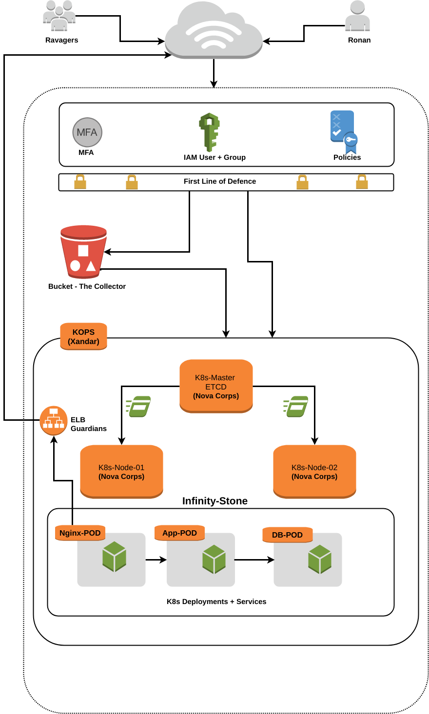

<p align="center">
   </image>
</p>


# brickblock-galaxy
Easter-Sunday-Treat-by-Star-Lord-from-KnowWhere.

## The Goal
To solve the problem mentioned by [brickblock-challenge-devops](https://github.com/brickblock-io/coding-challenge-devops).

## Difficulty Level
`Saving Galaxy was much Easier.`

## Architecture

Architecture created using site [DRAW.IO](https://www.draw.io/).

The XML file for below architecture is present in `img directory`.

<p align="center">
   </image>
</p>

## Steps to get Infinity Stone
1. Create Separate User/Group and assign specific Policies in IAM with root user. 
     New created User will be used to make KOPS Cluster and administer it.
1. Create a S3 Bucket to store the state of the KOPS-Cluster.
1. Create KOPS Cluster.
1. Create SELF-SIGNED Certificate for NGINX. This step is Optional.
1. Create Kubernetes Resources.

## Step-01-to-Infinity-Stone
**Create IAM User, Group and Policies**

Change directory `01.create_kops_user`.

I made a script which will Automate the creation and deletion of Group, User, attach Policies and Users to Group.
The script will take one arguement either `create or delete`.

You can not run script with any other random arguement or more than one arguement.

`create` arguement will create the user, group, attaching policies and groups for you.
`delete` arguement will delete the user, group, attaching policies and groups for you.

**Keep-In-Mind**

* Use your root account access key and secret to run this script.
* Do not DELETE file `kops_user_access_keys.txt` in directory `01.create_kops_user`. Newly created User key/secret details are stored there.
* Take a backup if possible for this file.
* Logs are created in file `kops_user_creation_logs-date +%F`.txt file for reference.

**Create-Delete-AWS-IAM-User-Group-Policies**

```
star-lord@Guardian:01.create_kops_user$ ./01.create_iam_user.sh create
star-lord@Guardian:01.create_kops_user$ 
star-lord@Guardian:01.create_kops_user$ 
star-lord@Guardian:01.create_kops_user$ ./01.create_iam_user.sh delete
star-lord@Guardian:01.create_kops_user$ 
```

## Step-02-to-Infinity-Stone
**Create the S3 Bucket**

Change directory `02.create_kops_bucket`.

Creating bucket using aws command line is much easier. But I created `AWS-S3-Bucket` using `TERRAFORM` just to show off my versatility as `DevOps`.

**Keep-In-Mind**

* You need to update file `00.variables.tf`. This contains the secret and access key values you get in STEP-01.
* The Name of Bucket in file  `02.create_bucket.tf` which is hard coded.

**AWS-S3-Bucket-Creation-Using-Terraform**

```
star-lord@Guardian:02.create_kops_bucket $ 
star-lord@Guardian:02.create_kops_bucket $ terraform init
star-lord@Guardian:02.create_kops_bucket $ terraform plan
star-lord@Guardian:02.create_kops_bucket $ terraform apply -auto-approve
star-lord@Guardian:02.create_kops_bucket $ 
star-lord@Guardian:02.create_kops_bucket $ 
star-lord@Guardian:02.create_kops_bucket $ terraform destroy
star-lord@Guardian:02.create_kops_bucket $ 
```

## Step-03-to-Infinity-Stone
**Create the KOPS Gossip-Based-Cluster**

Change directory `03.create_kops_cluster`.

Kops 1.6.2 adds an experimental support for gossip-based, uses `Weave Mesh`, discovery of nodes. 
This makes the process of setting up Kubernetes cluster using `Kops DNS-free`, and much more simplified.

**The only requirement to trigger this is to have the cluster name end with `.k8s.local` **

More details can be found on [KOPS-Installation](https://github.com/kubernetes/kops/blob/master/docs/aws.md).

**Keep-In-Mind**

* Make sure that Cluster-Name ends with k8s.local.
* Export the Cluster-Name variable like `export NAME=myfirstcluster.k8s.local`.
* Export the KOPS STATE like `export KOPS_STATE_STORE=s3://name-of-bucket-from-STEP-02`.
* You don’t have to use environmental variables here. You can always define the values using the –name and –state flags later in kops command. 
* KOPS will make 1 Master and 2 Node Cluster.

**KOPS-Cluster-Creation**

```
star-lord@Guardian:03.create_kops_cluster$ export NAME=kops.cluster.k8s.local
star-lord@Guardian:03.create_kops_cluster$ export KOPS_STATE_STORE=s3://starlordkopsbucketbb
star-lord@Guardian:03.create_kops_cluster$ kops create cluster kops.cluster.k8s.local --zones eu-central-1a --yes
star-lord@Guardian:03.create_kops_cluster$ kops validate cluster
star-lord@Guardian:03.create_kops_cluster$ 
star-lord@Guardian:03.create_kops_cluster$ 
star-lord@Guardian:03.create_kops_cluster$ 
star-lord@Guardian:03.create_kops_cluster$ 
star-lord@Guardian:03.create_kops_cluster$ kops delete cluster kops.cluster.k8s.local --yes
```

## Step-04-to-Infinity-Stone
**Create the Self-Signed-Certificate/Optional-Step**

Change directory `04.create_nginx_cert`.

We create the self-signed certificate to handle HTTPS.
Yes, its not secure but the `TASK have an additional cookie` if you made your cluster app running over HTTPS.
Script `01.create_cert.sh` will create the cert and key which is `WILDCARD Certificate` for domain ending with `*.k8s.local`.

**Keep-In-Mind**

*  There is no need infact of this step. As I created the configMaps and including it in YAML files.
* If you need HTTP, this step is not needed.

**Self-Signed-Certificate-Creation**

```
star-lord@Guardian:04.create_nginx_cert$  sudo openssl req -x509 -nodes -days 365 -newkey rsa:2048 -keyout nginx.key \ 
-out nginx.crt -subj "/C=SL/ST=Know-Where/L=Terra/O=StarLord/OU=Guardians/CN=*.k8s.local"
```

## Step-05-to-Infinity-Stone
**Create the Kubernetes Resources**

Change directory `05.create_k8s_resources`.

I have created the Kubernetes Resource `YAML` files for FrontEnd API Consumer i.e. Nginx, BackEnd Node App and Database DB.

**Keep-In-Mind**

* The ConfigMap for nginx default.conf file, we need to change the service name of backend-app. In our case, it is `my-emp`.
* Check file `01.create_nginx_config_maps.yaml` i.e. `proxy_pass http://my-emp`.
* No need to change other configMaps.
* For HPA or autoscaling, please make sure that `Heapster` Pod is running to collect metrics.

**Run Kubernetes Resources**

```
star-lord@Guardian:05.create_k8s_resources$ 
star-lord@Guardian:05.create_k8s_resources$ for i in `ls *.yaml | sort `; do kubectl create -f $i; done
star-lord@Guardian:05.create_k8s_resources$ 
star-lord@Guardian:05.create_k8s_resources$ 
star-lord@Guardian:05.create_k8s_resources$ 
star-lord@Guardian:05.create_k8s_resources$ for i in `ls *.yaml | sort `; do kubectl delete -f $i; done
star-lord@Guardian:05.create_k8s_resources$ 
star-lord@Guardian:05.create_k8s_resources$ 
```

#### Tasks Completion Matrix

|Tasks                                               | Comments                                                |
|--------------------------------------------- |---------------------------------------------------------------|
|**`Acceptance Criteria`**                                          |                                                                    |
|01. K8s Cluster Up and Running                                    | Finished                                                    |
|02. FrontEnd Application Running and Accessible     | Finished                                                    |
|03. FrontEnd Displays Data from API                            |  Finished                                                   |
|04. Code Accessible in GIT                                              | Finished                                                     |
|**`Bonus Round`**                                                      |                                                                      |
|01. HTTPS                                                                          | **`Self-Signed-Cert`**                          |
|02. Automate the Cluster                                               | Finished                                                       |
|03. Auto-Scaling                                                               | Finished                                                       |
|04. API Hooked to Database                                         | Finished                                                        |
|05. Isolated Staging/Production                                   | **`Only Staging`**                                 |

